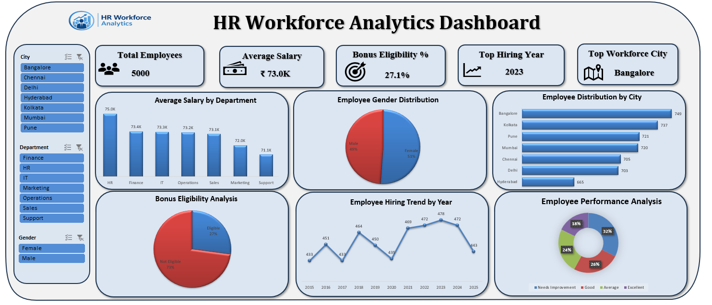

# HR Workforce Analytics Dashboard | Microsoft Excel

## Project Overview

The HR Workforce Analytics Dashboard is an interactive Microsoft Excel project designed to help HR teams and business stakeholders analyze workforce data through meaningful visualizations and key performance indicators (KPIs). The dashboard transforms raw employee data into clear, interactive reports, making it easier to monitor workforce trends, evaluate employee performance, and support data-driven decision-making.

---

## Client Brief

The HR department manages employee information across multiple departments and locations. Although the organization collects a large amount of workforce data, generating reports manually is time-consuming and often makes it difficult to identify meaningful trends.

The client requires an interactive dashboard that provides a centralized view of workforce metrics, allowing users to analyze employee distribution, salary trends, hiring patterns, performance, and bonus eligibility. The dashboard should also include interactive filters so users can quickly explore the data based on departments, cities, and gender.

---

## Problem Statement

Managing workforce data through spreadsheets can make it difficult to monitor employee trends and generate meaningful insights. HR teams often spend significant time preparing reports to answer questions related to employee distribution, salary analysis, hiring trends, performance, and bonus eligibility.

To address these challenges, this project develops an interactive HR Workforce Analytics Dashboard using Microsoft Excel. The dashboard transforms raw employee data into meaningful visualizations, enabling HR professionals to monitor key workforce metrics, identify trends, and support effective data-driven decision-making.

---

## Project Objective

The objective of this project is to design and develop an interactive HR analytics dashboard that provides a comprehensive view of workforce data through dynamic visualizations and key performance indicators.

The dashboard is designed to simplify HR reporting, improve data accessibility, and enable users to analyze workforce metrics efficiently through interactive filters and visual reports.

---

## Business Goals

- Provide a centralized view of key HR metrics.
- Monitor workforce distribution across departments and cities.
- Compare average salaries between departments.
- Track employee hiring trends over different years.
- Evaluate employee performance.
- Analyze bonus eligibility.
- Enable interactive reporting using slicers.
- Support HR professionals in making informed business decisions.

---

## Dataset Overview

The project uses a workforce dataset containing **5,000 employee records**.

The dataset includes:

- Employee ID
- Employee Name
- Gender
- Department
- Designation
- City
- Joining Date
- Date of Birth
- Salary
- Bonus
- Attendance
- Performance Rating
- Manager Details

Additional calculated fields were created to support reporting, including age, experience, joining year, bonus eligibility, attendance percentage, and salary-related metrics.

---

## Dashboard Features

The dashboard provides an interactive overview of workforce performance through:

- Workforce KPI Cards
- Average Salary by Department
- Employee Distribution by City
- Gender Distribution Analysis
- Bonus Eligibility Analysis
- Employee Hiring Trends
- Employee Performance Analysis
- Interactive Slicers for City, Department, and Gender

---

## Dashboard Preview

(Add your dashboard screenshot here)

---

## Tools Used

- Microsoft Excel
- Pivot Tables
- Pivot Charts
- Slicers
- Excel Formulas

---

## Skills Applied

- Data Cleaning
- Data Analysis
- Dashboard Design
- KPI Development
- Data Visualization
- HR Analytics
- Business Analytics
- Data Storytelling

---

## Key Insights

- Workforce distribution can be analyzed across multiple cities and departments.
- Salary trends help compare compensation across different departments.
- Hiring trends highlight recruitment patterns over the years.
- Performance analysis helps identify workforce performance levels.
- Bonus eligibility provides insight into employee incentive distribution.
- Interactive filters enable dynamic exploration of workforce data.

---

## Challenges Faced

- Cleaning and preparing employee data for analysis.
- Designing a dashboard that remains simple while displaying multiple insights.
- Selecting the right visualizations for different business questions.
- Creating dynamic reports using Pivot Tables, Pivot Charts, and Slicers.
- Ensuring consistent formatting and an intuitive dashboard layout.

---

## Areas for Improvement

- Add drill-down functionality for detailed employee analysis.
- Integrate Power Query for automated data refresh.
- Include advanced HR metrics such as employee attrition and retention analysis.
- Improve dashboard performance for larger datasets.
- Connect the dashboard to live data sources for real-time reporting.

---
## Dashboard Preview

### HR Workforce Analytics Dashboard

## Author

**Harshavardhan Gorre**
